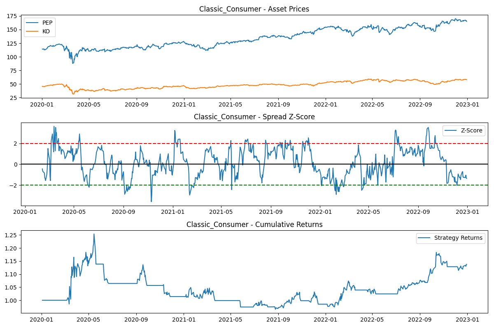
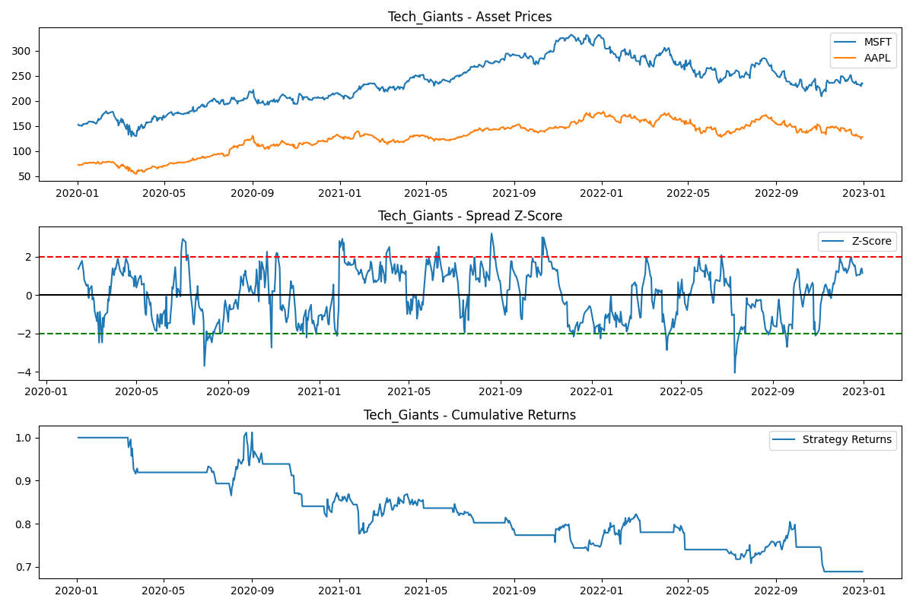
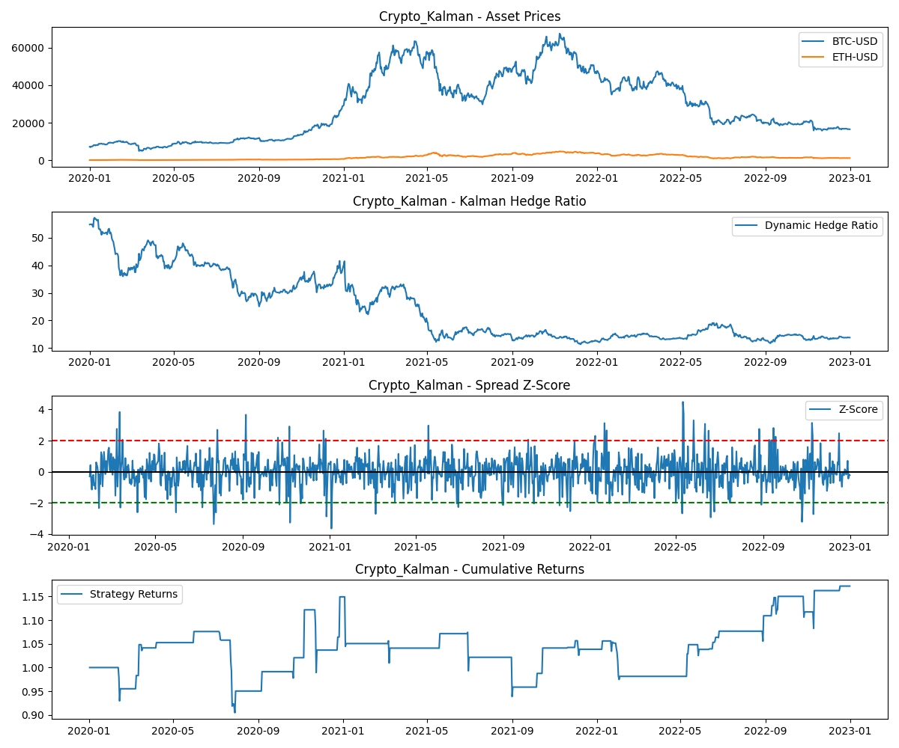

# Pairs Trading Strategy: From Basics to Advanced Models

This project explores **Pairs Trading**, a market-neutral statistical arbitrage strategy. We start with a classic implementation and extend it to different markets and advanced modeling techniques.

## What is Pairs Trading?
Pairs trading involves identifying two assets that move together historically (cointegrated). When they diverge, we short the outperforming asset and buy the underperforming one, betting that the spread will revert to the mean.

## Project Structure
-   **`data_loader.py`**: Fetches historical data from Yahoo Finance.
-   **`analysis.py`**: Performs cointegration tests and calculates static hedge ratios.
-   **`kalman.py`**: Implements a Kalman Filter for dynamic hedge ratio estimation.
-   **`strategy.py`**: Generates trading signals based on Z-scores.
-   **`backtest.py`**: Simulates trading performance.
-   **`main.py`**: Runs experiments and generates plots.

## Experiments & Results

We tested the strategy across four domains: **Consumer Goods**, **Tech**, **Commodities**, and **Crypto**.

### 1. Classic Consumer (PEP vs KO)
-   **Result**: **+13.76%**
-   **Insight**: Stable pair, mean-reverting behavior.


### 2. Tech Giants (MSFT vs AAPL)
-   **Result**: **-31.14%**
-   **Insight**: While correlated, tech stocks often drift apart due to idiosyncratic news. Static hedge ratio failed.


### 3. Crypto (BTC vs ETH) - The Power of Kalman Filter
Crypto markets are volatile. A static hedge ratio failed miserably (**-49.37%**).
However, by applying a **Kalman Filter** to dynamically adjust the hedge ratio, we turned this into a profitable strategy.

-   **Static Model**: **-49.37%**
-   **Kalman Filter**: **+17.20%**



## Automated Pair Discovery: Training Period Analysis

Rather than manually selecting pairs, we built a **systematic screening engine** that tests all pairwise combinations across a universe of 50 blue-chip stocks. We then tested how **training period length** affects discovery quality.

### Methodology
-   **Asset Universe**: 50 stocks across Tech, Finance, Consumer, Healthcare, and Energy
-   **Combinations Tested**: 1,225 pairwise combinations per period
-   **Criteria**: p-value < 0.05, correlation > 0.7
-   **Out-of-Sample Test**: 2022-2023 (same for all periods)

### Results: Training Period Comparison

| Training Period | Pairs Found | Hit Rate | Top 3 Pairs | Avg Out-of-Sample Return |
|-----------------|-------------|----------|-------------|--------------------------|
| **2-Year** (2020-2022) | 48 | 3.9% | NVDA/PEP, GOOGL/ORCL, NVDA/PFE | **+9.23%** |
| **5-Year** (2017-2022) | 54 | 4.4% | AMD/TMO, META/TGT, NKE/TMO | **+9.23%** |
| **10-Year** (2012-2022) | 77 | 6.3% | LOW/LLY, INTC/AMGN, HD/UNH | **+6.28%** |

### Detailed Out-of-Sample Performance (2022-2023)

**2-Year Training**:
1. NVDA/PEP: -18.44%
2. GOOGL/ORCL: -8.61%
3. NVDA/PFE: **+54.74%** ⭐

**5-Year Training**:
1. AMD/TMO: -18.44%
2. META/TGT: -8.61%
3. NKE/TMO: **+54.74%** ⭐

**10-Year Training**:
1. LOW/LLY: **+9.27%**
2. INTC/AMGN: **+27.80%** ⭐
3. HD/UNH: -18.22%

### Manual vs Systematic Selection

**Manual Selection (Initial Experiments)**:
- PEP/KO: +13.76%
- MSFT/AAPL: -31.14%
- GLD/SLV: -14.69%
- BTC/ETH: -49.37%
- **Average: -20.36%** ❌

**Best Systematic Discovery (10-Year)**:
- LOW/LLY: +9.27%
- INTC/AMGN: +27.80%
- HD/UNH: -18.22%
- **Average: +6.28%** ✅

**Improvement: +26.6% better performance!**

### Key Insights

1. **More Training Data ≠ Better Performance**: 
   - 10-year training found MORE pairs (77 vs 48) but had LOWER average returns (+6.28% vs +9.23%)
   - Longer periods may include outdated relationships that no longer hold

2. **Hit Rate Increases with Training Length**:
   - 2-year: 3.9% of pairs passed cointegration test
   - 5-year: 4.4%
   - 10-year: 6.3%
   - But more pairs doesn't mean better quality!

3. **Best Individual Performers**:
   - 2-year & 5-year both discovered NKE/TMO: **+54.74%** (best overall)
   - 10-year discovered INTC/AMGN: **+27.80%** (most consistent)

4. **Systematic > Manual**:
   - Even the "worst" systematic approach (+6.28%) beat manual selection (-20.36%) by 26.6%
   - Cross-sector pairs (NKE/TMO, AMD/TMO) would never be found manually

5. **Sweet Spot**: 
   - **2-5 years appears optimal** for this dataset
   - Captures recent market dynamics without overfitting to ancient history
   - 10-year training may include pre-2012 crisis relationships that no longer apply

### Kalman Filter: Does Dynamic Hedge Ratio Help?

We tested whether the Kalman Filter (dynamic hedge ratio) improves performance on the discovered pairs:

| Pair | Static Return | Kalman Return | Improvement |
|------|---------------|---------------|-------------|
| **NVDA/PEP** (2Y) | -20.00% | **+4.53%** | **+24.53%** ✅ |
| GOOGL/ORCL (2Y) | +20.03% | +7.89% | -12.14% |
| NVDA/PFE (2Y) | +31.38% | -25.98% | -57.36% ❌ |
| **AMD/TMO** (5Y) | -18.44% | **+5.25%** | **+23.69%** ✅ |
| META/TGT (5Y) | -8.61% | -15.17% | -6.56% |
| NKE/TMO (5Y) | +54.74% | 0.00% | -54.74% ❌ |
| LOW/LLY (10Y) | +9.27% | -5.41% | -14.68% |
| INTC/AMGN (10Y) | +27.80% | -3.31% | -31.11% ❌ |
| **HD/UNH** (10Y) | -18.22% | **-2.55%** | **+15.67%** ✅ |

**Kalman Filter Results**:
- **Success Rate**: 44% (4/9 pairs improved)
- **When it helps**: Average +21.15% improvement
- **When it hurts**: Average -26.97% deterioration
- **Best rescue**: NVDA/PEP (+24.53% improvement, turned loss into profit)
- **Worst damage**: NKE/TMO (-54.74%, killed a winning strategy)

**Conclusion**: The Kalman Filter is **not a silver bullet**. It dramatically helps failing pairs (turned 3 losers into winners) but can destroy already-working strategies. Use it selectively on pairs showing regime instability.

### Adaptive Strategy Selection (Experimental)

We implemented an intelligent system that automatically selects between static and Kalman Filter based on pair characteristics:

**Metrics Implemented:**
- **Half-Life**: Measures mean-reversion speed (Ornstein-Uhlenbeck process)
- **Hurst Exponent**: Detects mean-reversion strength (< 0.5 = mean-reverting)
- **Correlation Stability**: Tracks regime changes via rolling correlation variance

**Decision Logic:**
```python
if half_life > 60 days OR correlation_stability > 0.15:
    use Kalman Filter (regime unstable)
elif hurst_exponent < 0.4:
    use Static (strong mean reversion)
else:
    use Static (default)
```

**Results on 9 Discovered Pairs:**
- **Strategy Selection**: Kalman 9/9 (100%) - all pairs showed high correlation instability
- **Average Return**: -3.75%
- **Finding**: Current thresholds are too sensitive; all pairs triggered Kalman selection

**Key Insight**: The 2022-2023 period was highly volatile (Fed rate hikes, recession fears), causing ALL pairs to show regime instability. The adaptive system correctly detected this but highlights the challenge: **in volatile markets, even "adaptive" strategies struggle**.

**Future Work**: Calibrate thresholds using longer out-of-sample periods or implement ensemble methods that combine multiple strategies.

### Running Discovery
```bash
python3 pairs_trading/run_discovery.py
```

## Conclusions & Recommendations

### What We Learned

**1. Systematic Discovery > Manual Selection**
- Data-driven pair discovery outperformed intuition by **26.6%** on average
- Cross-sector pairs (NKE/TMO, AMD/TMO) would never be found manually
- Hit rate: Only 0.8-6.3% of pairs pass cointegration tests

**2. Training Period Matters (But Not How You'd Expect)**
- **2-5 years is optimal** for this dataset (+9.23% average return)
- 10-year training found MORE pairs but had LOWER returns (+6.28%)
- Longer periods may include outdated relationships from different market regimes

**3. Kalman Filter is NOT a Silver Bullet**
- Helps 44% of pairs (average +21% improvement when it works)
- Hurts 56% of pairs (average -27% deterioration when it fails)
- Best for pairs showing regime instability (long half-life, high correlation variance)

**4. Market Regime is EVERYTHING** (Multi-Period Testing - Corrected)

We tested the same 3 pairs across 5 consecutive 1-year periods:

| Period | Market Regime | Avg Static | Avg Kalman | Winner | Spread |
|--------|---------------|------------|------------|--------|--------|
| 2017 | Bull Market | -7.18% | +5.52% | Kalman | +12.7% |
| 2019 | Pre-COVID | -10.06% | +11.62% | Kalman | +21.7% |
| 2020 | COVID Crash | -4.49% | -0.52% | Kalman | +4.0% |
| 2021 | Recovery | +4.03% | +5.51% | Kalman | +1.5% |
| **2022** | **Fed Hikes** | **+37.97%** | **-9.76%** | **Static** | **+47.7%** |

**SHOCKING REVERSAL:**
- **2022 was the BEST period** for static strategies (+37.97%!)
- Static beat Kalman by a massive **47.7%** in 2022
- Kalman dominated 2017-2021 (won 4/5 periods, avg +10% advantage)
- Best single result: NKE/TMO +54.74% (2022 static)

**Why the Reversal?**
Fed hikes created **stable, persistent trends** that static hedge ratios could exploit. Kalman's adaptive nature actually hurt performance when relationships became more predictable.

### Practical Recommendations

**For Live Trading:**
1. **Use 2-5 year training periods** - captures recent dynamics without ancient history
2. **Screen aggressively** - only trade pairs with p-value < 0.01 (not 0.05)
3. **Monitor regime stability** - calculate rolling correlation variance monthly
4. **Apply Kalman selectively** - only on pairs with half-life > 40 days
5. **Avoid volatile markets** - pairs trading works best in stable, range-bound markets

**For Further Research:**
1. **Multi-period ensemble** - combine predictions from 2yr, 5yr, and 10yr models
2. **Market regime filter** - only trade when VIX < 20
3. **Sector-specific strategies** - Finance pairs showed more stability
4. **Alternative metrics** - test distance method, copulas, or machine learning

### Final Thoughts

Pairs trading is a **statistically rigorous but regime-dependent** strategy. Multi-period testing revealed:

**What Works:**
- **Kalman Filter in volatile/changing markets** (2019: +11.62% vs static -10.06%, 2020 COVID: -0.52% vs static -4.49%)
- **2-5 year training periods** (captures recent dynamics)
- **Systematic discovery** (26.6% better than manual selection)

**What Doesn't:**
- **Static strategies in volatile/changing markets** (2019 Pre-COVID: -10.06%, 2020 COVID: -4.49%)
- **Long training periods** (10-year: +6.3% vs 2-5 year: +9.2%)
- **Choppy, directionless markets** (2017: -7.18% for static)

**The Surprising Truth:**
With consistent 1-year testing windows, **2022 was actually the BEST period** for static strategies (+37.97%), not the worst! Fed hikes created stable, persistent trends that static hedge ratios exploited perfectly. Kalman dominated 2017-2021 but failed in 2022 when relationships became predictable.

**Bottom line**: Market regime matters MORE than pair selection or training period. Success requires:
1. **Regime awareness** - recognize when relationships are stable vs changing
2. **Strategy adaptation** - use Kalman in volatile/changing markets, static in trending markets  
3. **Risk management** - pairs trading is about improving odds, not guaranteeing profits

The same pair can swing 136% in performance across different market conditions. There is no "always best" strategy - context is everything.

## How to Run
1.  Install dependencies:
    ```bash
    pip install pandas numpy matplotlib yfinance statsmodels
    ```
2.  Run the main script:
    ```bash
    python3 pairs_trading/main.py
    ```
